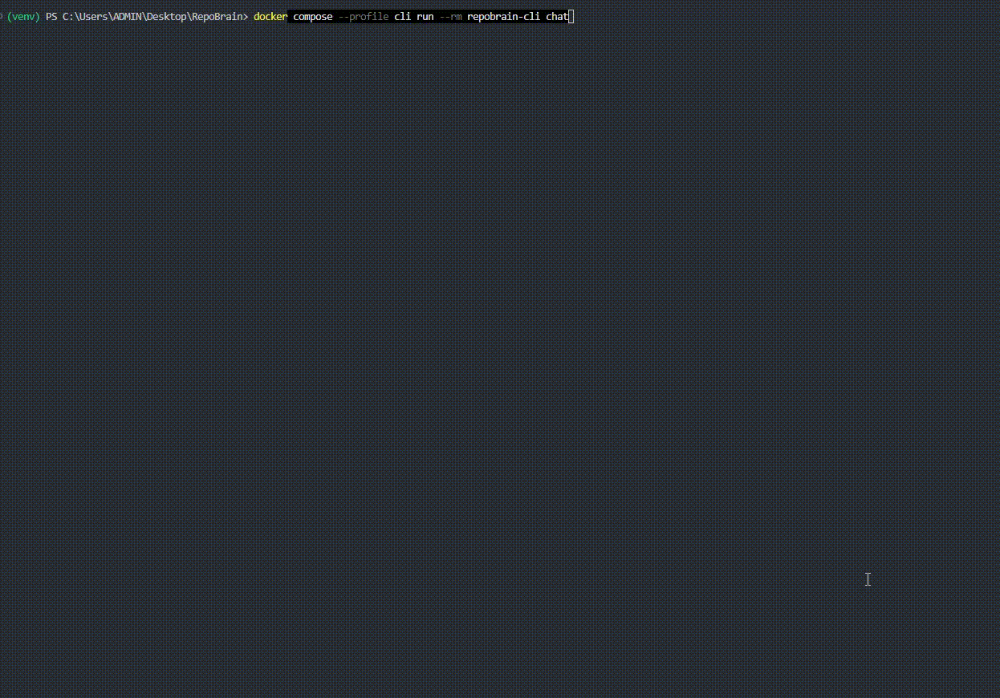

# RepoBrain

[](https://github.com/hieuchaydi/RepoBrain/actions/workflows/ci.yml)
[](pyproject.toml)
[](LICENSE)

RepoBrain is a local-first AI codebase analyst. Point it at any repo, build a local index, then ask where logic lives, how flows connect, what files are risky, and which files an agent should inspect before editing.

**In one run, RepoBrain gives you grounded files, trace paths, and edit targets without requiring a hosted backend or API key.**

What you get in the first session:

- local index + evidence-backed retrieval
- route/service/job flow hints for faster codebase orientation
- ranked edit targets with confidence and warnings


## 30-Second Demo



## Start Here (New Users)

If you only run one command, run this:

```bash
repobrain first-look --repo /path/to/your-project --no-report --format text
```

`first-look` initializes local state, indexes the repo, and runs starter questions.
Use `--no-report` for a faster first run. Remove that flag when you want `.repobrain/report.html`.

Fast path from a clean clone:

```bash
python -m pip install --cache-dir .pip-cache -e .
repobrain first-look --repo /path/to/your-project --no-report --format text
repobrain chat
```

Windows PowerShell:

```powershell
python -m pip install --cache-dir .pip-cache -e .
repobrain first-look --repo "C:\path\to\your-project" --no-report --format text
repobrain chat
```

Optional one-time bootstrap for a brand-new virtualenv:

```bash
python -m pip install --upgrade pip setuptools wheel
```

Then open the browser UI (optional):

```bash
repobrain serve-web --open
```

In the web UI you can click `Choose folder` or paste a path, then run `Import + Index`.
Example output: [examples/first-look.md](examples/first-look.md).

## Benchmark Snapshot (Local Run)

Snapshot date: **2026-04-20**

| Scenario | Command | Files | Chunks | Symbols | Edges | Parser | Time |
| --- | --- | --- | --- | --- | --- | --- | --- |
| First-look on RepoBrain repo | `python -m repobrain.cli first-look --repo . --format text` | 26 | 88 | 76 | 295 | tree-sitter | 11.62s |

Confidence from the same run:

- `query`: `0.914` (strong)
- `trace`: `0.936` (strong)
- `targets`: `0.866` (strong)

PowerShell repro (keeps state files local to repo):

```powershell
$env:PYTHONPATH = "src"
$env:REPOBRAIN_ACTIVE_REPO_FILE = ".repobrain\\active_repo.txt"
$env:REPOBRAIN_WORKSPACE_STATE_FILE = ".repobrain\\workspace.json"
python -m repobrain.cli first-look --repo . --format text
```


## Overview

RepoBrain exists to make coding agents less reckless.

Most AI coding failures do not start at code generation. They start earlier, when the agent reads the wrong files, misses a route-to-service or job-to-handler flow, or sounds confident without enough evidence.

RepoBrain focuses on that pre-generation step:

- index the repository into local metadata, chunks, symbols, and edges
- retrieve grounded evidence with BM25, embeddings, and reranking
- trace likely flow across route, service, job, and config surfaces
- rank edit targets with explicit rationale instead of hidden intuition
- scan a repo and produce a concise project review with the most important risks first
- lower confidence and emit warnings when evidence is weak or contradictory

The product is intentionally local-first and conservative. It ships as a CLI, a browser-based local UI, a local report/dashboard, and a stdio MCP-style adapter for tools such as Cursor, Codex, and Claude Code.

## Why RepoBrain

When coding agents fail, the root cause is usually not "bad code generation". It is bad context.

RepoBrain focuses on the step before generation:

- Find the right files.
- Surface the most relevant symbols and snippets.
- Trace likely route -> service -> job flows.
- Rank edit targets with evidence instead of intuition.
- Downgrade confidence when the evidence is weak or contradictory.

This makes RepoBrain useful both as:

- a CLI you can run locally against any repo
- a stdio MCP-style tool adapter for Cursor, Codex, and Claude Code

## How It Differs

| Tool | Best for | RepoBrain's lane |
| --- | --- | --- |
| `grep` / `ripgrep` | exact text search | grounded answers with symbols, snippets, edges, and confidence |
| ChatGPT paste | small snippets | whole-repo local indexing before asking questions |
| Cursor / IDE agents | editing inside the IDE | pre-edit context maps, review reports, and MCP-ready evidence |
| Sourcegraph | enterprise code search | lightweight local-first analysis for one developer or small teams |

## What Ships Today

- Python package under `src/repobrain`
- Local SQLite metadata store in `.repobrain/metadata.db`
- Persisted vector index in `.repobrain/vectors/`
- Python + TypeScript/JavaScript support
- Hybrid retrieval with BM25 + local hash embeddings + reranking
- Grounding harness with planner, retriever, file selector, evidence collector, edit-target scorer, and self-check
- Markdown docs for architecture, CLI, MCP, config, evaluation, demos, releases, and run guides

## Current Unreleased Track

This unreleased track now maps most closely to the `0.5.x` integration line: it bundles provider adapters, provider smoke checks, a React browser UI, and release-facing diagnostics into one local workflow.

- Interactive local chat loop through `repobrain chat`
- Saved review baselines through `repobrain baseline`
- Windows one-click launcher through `chat.cmd`
- Windows one-click dashboard launcher through `report.cmd`
- Human-readable terminal output through `--format text`
- Local HTML status dashboard through `repobrain report` or `repobrain report --open`
- Production ship gate through `repobrain ship`
- Live provider access checks through `repobrain provider-smoke`
- Active repo memory: run `repobrain init --repo <path>` once, then omit `--repo`
- Local browser UI through `repobrain serve-web --open`
- React TSX local browser UI with interface language controls, light/dark theme, structured diagnostics cards, tracked workspace switching, repo memory notes, and cross-repo query mode with workspace-wide evidence leaders, shared hotspots, and citation previews
- Persisted workspace memory shared across CLI chat, browser UI, and MCP tools
- Concise repo scan through `repobrain review --format text`
- Optional SDK-backed Gemini/OpenAI/Voyage/Cohere/Groq provider adapters
- Gemini rerank model pools through `GEMINI_MODELS` with automatic failover on quota/rate-limit exhaustion
- Optional tree-sitter parser adapter layer with heuristic fallback
- Parser usage stats in `repobrain index`
- Richer parser capability reporting in `repobrain doctor`

## How To Run

Full installation instructions are available in [docs-for-repobrain/docs/install.md](docs-for-repobrain/docs/install.md).

Fast path for most users:

```bash
python -m venv .venv
. .venv/bin/activate
python -m pip install --cache-dir .pip-cache -e .
repobrain first-look --no-report --format text
repobrain query "Where is payment retry logic implemented?"
repobrain trace "Trace login with Google from route to service"
repobrain targets "Which files should I edit to add GitHub login?"
repobrain chat
repobrain report --format text
repobrain serve-web --open
```

Pre-merge checks:

```bash
repobrain review --format text
repobrain ship --format text
repobrain patch-review --format text
```

From outside the target repo, initialize it once and then keep commands short:

```powershell
repobrain first-look --repo "C:\path\to\your-project" --no-report --format text
repobrain init --repo "C:\path\to\your-project" --format text
repobrain review --format text
repobrain baseline --format text
repobrain index --format text
repobrain query "Where is payment retry logic implemented?" --format text
repobrain patch-review --base main --format text
repobrain ship --format text
repobrain report --open
```

Or open the browser UI and import there:

```powershell
repobrain serve-web --open
```

Then paste the project path and click `Import + Index`.
On desktop runs, you can also click `Choose folder` to open the native OS folder picker through the local Python server.
For the one-page audit flow, click `Scan Project Review`.
The browser UI now ships as a React TSX frontend with interface language controls, a light/dark theme toggle, and structured `doctor` / `provider-smoke` diagnostics cards.
You can also switch tracked repos, save repo memory notes, run cross-repo query mode, and trigger `Patch Review` with either a base ref or an explicit file list from the same page.

Windows PowerShell:

```powershell
python -m venv venv
.\venv\Scripts\Activate.ps1
python -m pip install --cache-dir .pip-cache -e .
repobrain init
repobrain review --format text
repobrain baseline --format text
repobrain index
repobrain doctor
repobrain query "Where is payment retry logic implemented?" --format text
repobrain ship --format text
repobrain report --format text
```

Optional one-time bootstrap for a brand-new virtualenv:

```powershell
python -m pip install --upgrade pip setuptools wheel
```

Optional extras (install only what you need):

```bash
python -m pip install --cache-dir .pip-cache -e ".[dev]"
python -m pip install --cache-dir .pip-cache -e ".[providers]"
python -m pip install --cache-dir .pip-cache -e ".[tree-sitter]"
python -m pip install --cache-dir .pip-cache -e ".[mcp]"
```

Run the MCP-style transport:

```bash
repobrain serve-mcp
```

On Windows, double-click `chat.cmd` for local chat or `report.cmd` for the visual dashboard. Both launchers prefer the project virtualenv and set `PYTHONPATH=src`.

See the full run guide in [docs-for-repobrain/docs/run.md](docs-for-repobrain/docs/run.md).

Frontend source for the browser UI lives in `webapp/`. The built local assets are generated into `webapp/dist/`, and `repobrain serve-web` serves that React build directly. If `webapp/dist/` is missing, run `npm run build` inside `webapp/` once before starting the Python web server.

### Docker

Build the local image (fast default: core package + prebuilt frontend assets):

```powershell
docker build -t repobrain:local .
```

Build with optional extras:

```powershell
docker build -t repobrain:local --build-arg REPOBRAIN_PIP_EXTRAS=providers,tree-sitter,mcp .
```

Rebuild frontend inside Docker (slower):

```powershell
docker build -t repobrain:local --target runtime-webbuild .
```

Run the web UI:

```powershell
docker run --rm -it -p 8765:8765 -v ${PWD}:/workspace repobrain:local web
```

Run the CLI/chat:

```powershell
docker run --rm -it -v ${PWD}:/workspace repobrain:local cli
```

Docker Compose shortcuts:

```powershell
docker compose up --build repobrain-web
docker compose --profile cli run --rm repobrain-cli
```

Compose with optional extras:

```powershell
$env:REPOBRAIN_DOCKER_EXTRAS="providers,tree-sitter,mcp"
docker compose up --build repobrain-web
```

The web UI includes Gemini and Groq setup panels. After importing a project, paste the provider API key, keep or edit the model pool, and save. RepoBrain writes `.env` and `repobrain.toml` inside the mounted project so Docker and local runs share the same provider setup.

See [docs-for-repobrain/docs/docker.md](docs-for-repobrain/docs/docker.md).

There is also a separate human-friendly documentation frontend in `docs-for-repobrain/` for onboarding, repo reading, and demo prep:

```bash
cd docs-for-repobrain
npm install
npm run dev
```

That app renders a curated command guide, release-state summary, selected repo markdown files, shareable reader URLs, and one-click command copy actions inside a modern light/dark docs UI.

## CLI Surface

```text
repobrain first-look
repobrain start
repobrain demo
repobrain init
repobrain index
repobrain review
repobrain baseline
repobrain query "<question>"
repobrain ask "<question>"
repobrain trace "<question>"
repobrain map "<question>"
repobrain impact "<question>"
repobrain blast "<question>"
repobrain targets "<question>"
repobrain plan "<question>"
repobrain patch-review
repobrain benchmark
repobrain ship
repobrain doctor
repobrain check
repobrain provider-smoke
repobrain smoke
repobrain key gemini
repobrain key groq
repobrain chat
repobrain report
repobrain report --open
repobrain demo-clean --format text
repobrain serve-web
repobrain ui
repobrain workspace add "<path>"
repobrain workspace list
repobrain workspace use "<project>"
repobrain workspace summary
repobrain workspace remember "<note>"
repobrain workspace clear-notes
repobrain quickstart
repobrain release-check --format text
repobrain serve-mcp
```

For human-friendly terminal output, add `--format text` to `review`, `index`, `query`/`ask`, `trace`/`map`, `impact`/`blast`, `targets`/`plan`, `benchmark`, `doctor`/`check`, `provider-smoke`/`smoke`, or `report`. JSON remains the default for agents and automation.

Friendly aliases keep the CLI short without removing the original command names: `start=first-look`, `ask=query`, `map=trace`, `blast=impact`, `plan=targets`, `check=doctor`, `smoke=provider-smoke`, and `ui=serve-web`.

`repobrain patch-review` reviews the current working tree by default, supports `--base <ref>` for committed diff review, and supports `--files <path...>` for explicit repo-relative patch slices.

For release validation, run `repobrain release-check --format text` before packaging, then `repobrain release-check --require-dist --format text` after `python -m build` to confirm wheel/sdist artifacts include the React frontend assets.

Before a live demo, run `repobrain demo-clean --format text` to remove local test/build clutter such as `pytest_work_*`, root `dist/`, and cache directories while preserving `webapp/dist` for `repobrain serve-web`.

## Example Query Output

```json
{
  "query": "Where is payment retry logic implemented?",
  "intent": "locate",
  "top_files": [
    {
      "file_path": "app/services/retry_handler.py",
      "language": "python",
      "role": "service",
      "score": 3.18,
      "reasons": ["bm25", "reranked", "symbol:enqueue_payment_retry"]
    },
    {
      "file_path": "app/jobs/payment_retry_job.py",
      "language": "python",
      "role": "job",
      "score": 2.74,
      "reasons": ["bm25", "reranked"]
    }
  ],
  "confidence": 0.77
}
```

## Configuration

RepoBrain reads `repobrain.toml` from the repository root.

```toml
[project]
name = "RepoBrain"
repo_roots = ["."]
state_dir = ".repobrain"
context_budget = 12000

[indexing]
exclude = [
  ".git",
  ".venv",
  "venv",
  "__pycache__",
  ".pytest_cache",
  ".pytest_tmp",
  "pytest_tmp",
  "pytest_tmp_run",
  "pytest-cache-files-*",
  "node_modules",
  "dist",
  "build",
  ".repobrain",
]
chunk_max_lines = 80
chunk_overlap_lines = 12

[parsing]
prefer_tree_sitter = true
tree_sitter_languages = ["python", "typescript", "javascript"]

[providers]
embedding = "local"
reranker = "local"
```

Remote providers are opt-in. Install `.[providers]`, set the relevant API key in `.env`, and explicitly change `repobrain.toml` before RepoBrain sends code to Gemini, OpenAI, Voyage, Cohere, or Groq.

For the Gemini path, the CLI can write both `.env` and `repobrain.toml` without echoing the key:

```bash
repobrain key gemini --repo /path/to/your-project --format text
```

Inside `repobrain chat`, use `/key gemini` for the same secure prompt.

Cheap Gemini setup:

```toml
[providers]
embedding = "gemini"
reranker = "gemini"
gemini_embedding_model = "gemini-embedding-001"
gemini_output_dimensionality = 768
gemini_task_type = "SEMANTIC_SIMILARITY"
gemini_rerank_model = "gemini-2.5-flash"
gemini_models = ["gemini-2.5-flash", "gemini-2.5-flash-lite", "gemini-3-flash-preview"]
```

`gemini_rerank_model` is not locked to a single Gemini release. RepoBrain passes the configured string straight to the Gemini SDK, so you can switch between current supported models such as `gemini-2.5-flash`, `gemini-3-flash-preview`, or `gemini-2.5-flash-preview-09-2025`.

If you want automatic fallback when one Gemini rerank model hits quota or rate limits, set `GEMINI_MODELS` in `.env` as a comma-separated ordered pool. RepoBrain will keep the first healthy model active and move to the next one only for quota/rate-limit exhaustion errors.

For a one-key Groq setup, keep embeddings local and enable Groq reranking:

```bash
repobrain key groq --repo /path/to/your-project --format text
```

Inside `repobrain chat`, use `/key groq` for the same secure prompt.

```toml
[providers]
embedding = "local"
reranker = "groq"
groq_rerank_model = "llama-3.3-70b-versatile"
groq_models = ["llama-3.3-70b-versatile", "openai/gpt-oss-20b"]
```

Groq reranking calls Chat Completions with JSON Object Mode and reads `choices[0].message.content` as `{"score": number}`. If a Groq model hits quota, rate limit, or temporary provider-capacity exhaustion, RepoBrain tries the next model in `GROQ_MODELS`.

Start from `.env.example` and fill the key for the provider you enable.

## Design Principles

- Local-first by default
- Pluggable providers for local or cloud inference
- Evidence before edit suggestion
- Degrade gracefully when tree-sitter or remote SDKs are unavailable
- Keep the repo runnable without heavyweight infrastructure

## Comparison To Naive AI Code Search

| Capability | Naive agent scan | RepoBrain |
| --- | --- | --- |
| File discovery | heuristic guessing | indexed hybrid retrieval |
| Flow tracing | shallow grep | symbol + import + call-edge hints |
| Edit target ranking | implicit intuition | explicit scored suggestions |
| Confidence | rarely stated | explicit score + warnings |
| Transport | chat-only | CLI + stdio MCP-style adapter |

## Docs

- [Vision](docs-for-repobrain/docs/vision.md)
- [Install Guide](docs-for-repobrain/docs/install.md)
- [Docker Setup](docs-for-repobrain/docs/docker.md)
- [Product Spec](docs-for-repobrain/docs/product-spec.md)
- [Production Readiness](docs-for-repobrain/docs/production-readiness.md)
- [Production Gates v1](docs-for-repobrain/docs/production-gates-v1.md)
- [Release Checklist](docs-for-repobrain/docs/release-checklist.md)
- [Architecture](docs-for-repobrain/docs/architecture.md)
- [CLI](docs-for-repobrain/docs/cli.md)
- [User Experience](docs-for-repobrain/docs/ux.md)
- [Run Guide](docs-for-repobrain/docs/run.md)
- [MCP](docs-for-repobrain/docs/mcp.md)
- [Config](docs-for-repobrain/docs/config.md)
- [Contracts](docs-for-repobrain/docs/contracts.md)
- [Evaluation](docs-for-repobrain/docs/evaluation.md)
- [Demo Script](docs-for-repobrain/docs/demo-script.md)
- [Releases](docs-for-repobrain/docs/releases.md)
- [Implementation Plan](docs-for-repobrain/docs/implementation-plan.md)
- [Decision Log](docs-for-repobrain/docs/decision-log.md)
- [Backlog](docs-for-repobrain/docs/backlog.md)
- [Self Review](docs-for-repobrain/docs/self-review.md)
- [Roadmap](docs-for-repobrain/docs/roadmap.md)
- [Model Provider Roadmap](docs-for-repobrain/docs/model-provider-roadmap.md)
- [Security Policy](SECURITY.md)

## Release Track

- `0.1.x`: runnable MVP, local indexing, hybrid retrieval, edit targets
- `0.2.x`: parser quality upgrade, better graph extraction, stronger retrieval fusion
- `0.3.x`: confidence calibration, stronger impact analysis, safer change context
- `0.5.x`: provider adapters and richer MCP ergonomics
- `1.0.0`: trusted local codebase memory product with stable contracts

See the detailed breakdown in [docs-for-repobrain/docs/roadmap.md](docs-for-repobrain/docs/roadmap.md) and [docs-for-repobrain/docs/releases.md](docs-for-repobrain/docs/releases.md).

## Status

This repository is a runnable MVP focused on clean architecture, testability, and a strong OSS launch narrative.
